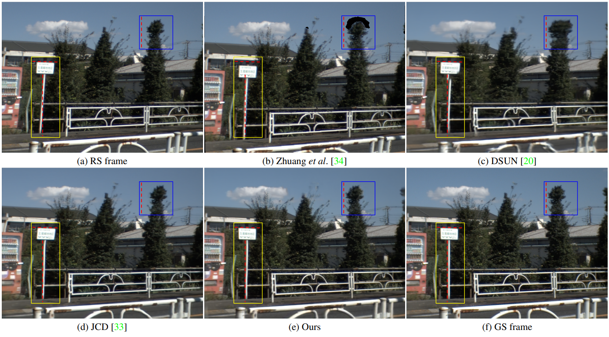
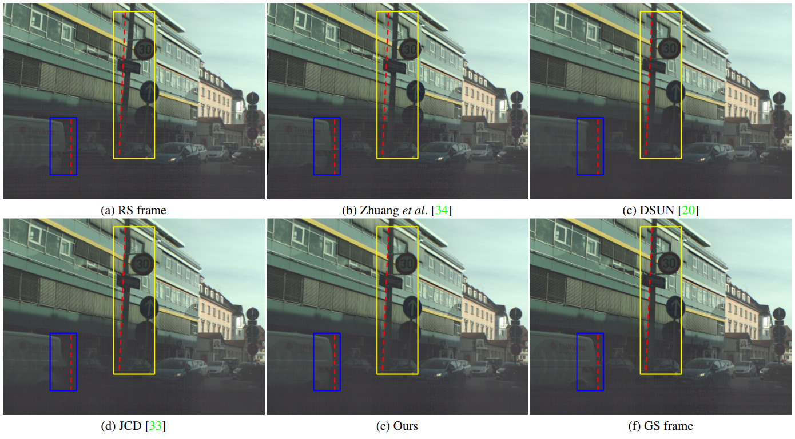

# BS-RSC

(This Repo is under construction)

[CVPR2022] Learning Adaptive Warping for Real-World Rolling Shutter Correction

> This paper proposes the first real-world rolling shutter (RS) correction dataset, BS-RSC, and a corresponding model to correct the RS frames in a distorted video. Mobile devices in the consumer market with CMOS-based sensors for video capture often result in rolling shutter effects when relative movements occur during the video acquisition process, calling for RS effect removal techniques. However, current state-of-the-art RS correction methods often fail to remove RS effects in real scenarios since the motions are various and hard to model. To address this issue, we propose a real-world RS correction dataset BS-RSC. Real distorted videos with corresponding ground truth are recorded simultaneously via a well-designed beam-splitter-based acquisition system. BS-RSC contains various motions of both camera and objects in dynamic scenes. Further, an RS correction model with adaptive warping is proposed. Our model can warp the learned RS features into global shutter counterparts adaptively with predicted multiple displacement fields. These warped features are aggregated and then reconstructed into high-quality global shutter frames in a coarse-to-fine strategy. Experimental results demonstrate the effectiveness of the proposed method, and our dataset can improve the model's ability to remove the RS effects in the real world.

## BS-RSC Dataset for Real-world RSC

We contribute the first real-world RSC dataset BS-RSC with various motions collected by a well-designed beam-splitter acquisition system, bridging the gap for real-world RSC tasks.

[[Download](https://drive.google.com/file/d/1Yp0kZJ6LGBmt1_kx92PtXaoJo6W2r9mW/view?usp=sharing)]

## Adaptive Warping

We propose an adaptive warping module to exploit high-quality GS frame restoration features better to mitigate inaccurate RS motion estimation and warping problems.

## Visual Results
Visual comparison on BS-RSC



Visual comparison on existing synthetic RSC dataset Fastec-RS



## ...

## Citation

If the proposed model and dataset are useful for your research, please consider citing our paper

```bibtex
@inproceedings{cao2022learning
  title={Learning Adaptive Warping for Real-World Rolling Shutter Correction},
  author={Cao, Mingdeng and Zhong, Zhihang and Wang, Jiahao and Zheng, Yinqiang and Yang, Yujiu},
  booktitle={CVPR},
  year={2022}
}
```
